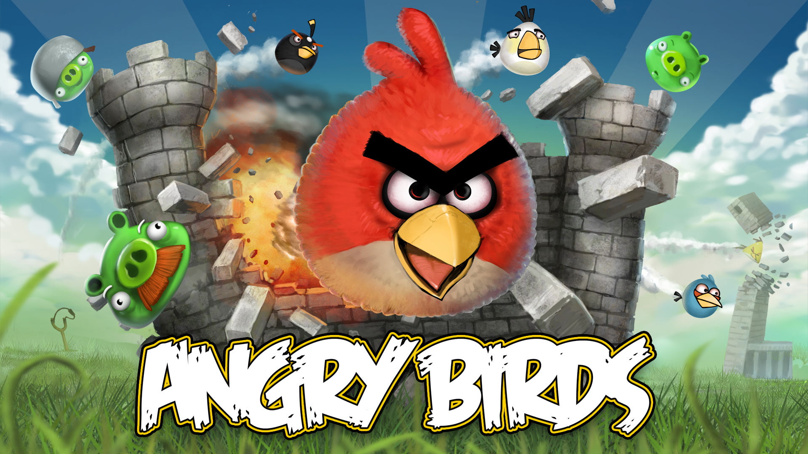
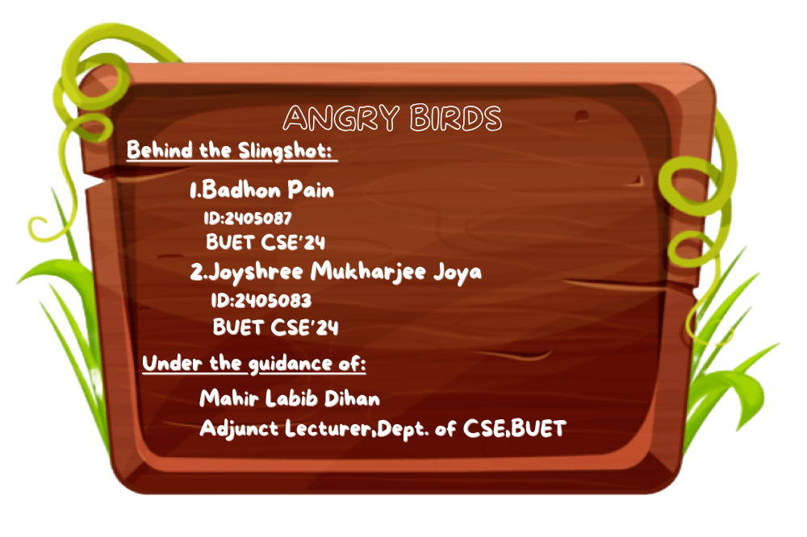
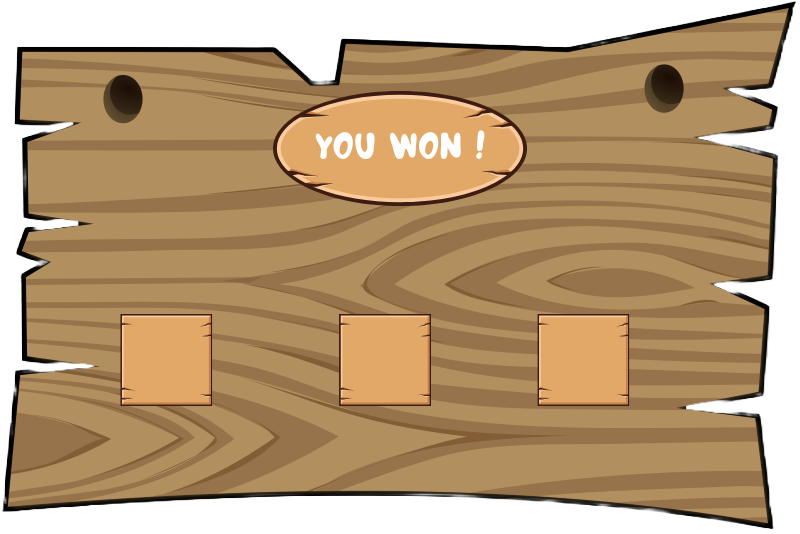
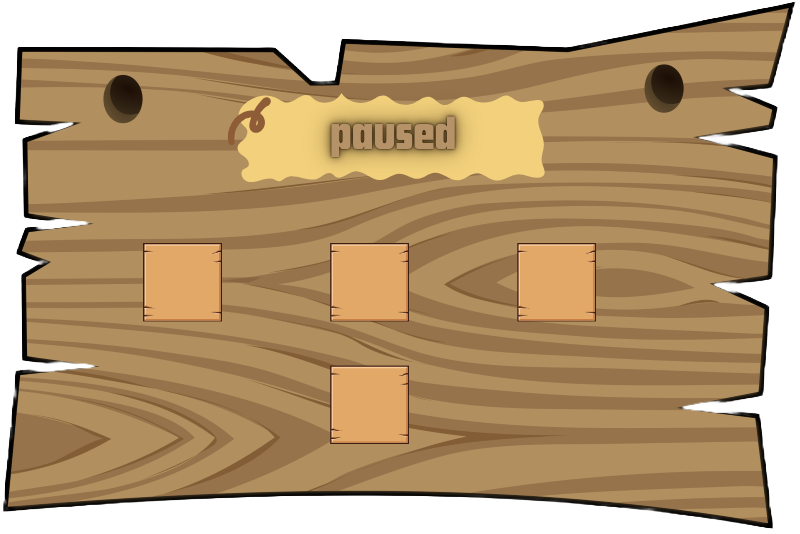
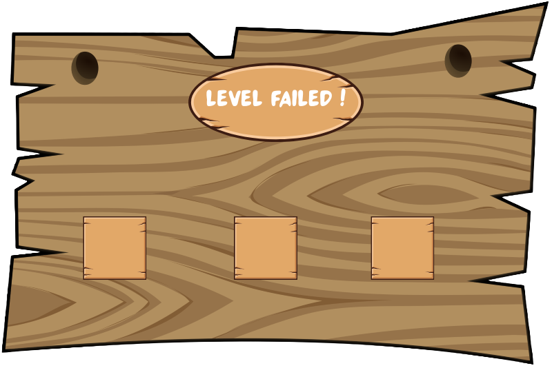

# Angry Birds

Custom remake of the classic Angry Birds game using iGraphics.h for BUET CSE_102 Project. Features multiple birds, physics-based gameplay, and dynamic block interactions.

Demo : [Checkout from YouTube] https://youtu.be/EdEt1Ufy0yE?si=lHaZWqr7nMxhvzXs
---

## 🏠 Main Menu

---
## © Credit

---

## 🎮 Available Birds
**Jay, Jake & Jim**

**Rosco**

**Chuck**

**Red**

**Hal**

**Bomb**

**Stella**

---

## ✅ Level Completed Screen

---
## ⏸️ Game Pause Screen

---

## ❌ Level Failed Screen

