# Angry Birds

Custom remake of the classic Angry Birds game using iGraphics.h for BUET CSE_102 Project. Features multiple birds, physics-based gameplay, and dynamic block interactions.

Demo : [Checkout from YouTube] https://youtu.be/EdEt1Ufy0yE?si=lHaZWqr7nMxhvzXs
---

## 🏠 Main Menu

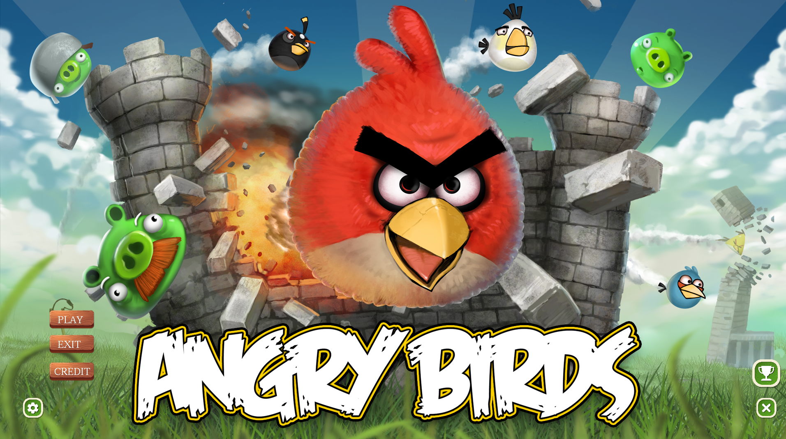

---
## © Credit

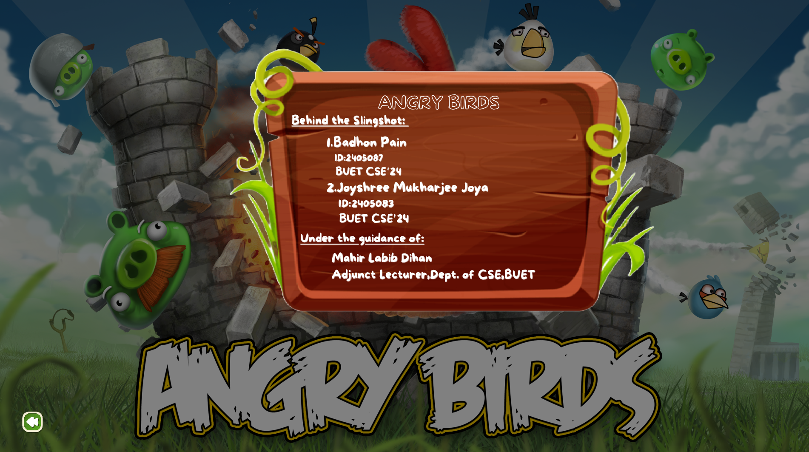

---
## ⚙️Settings

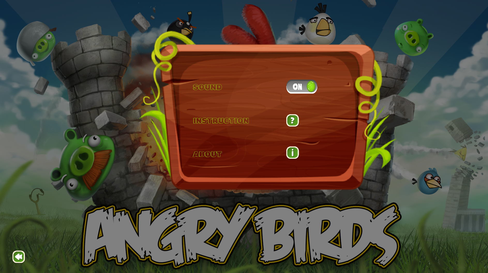

---
## 🛠️Instruction

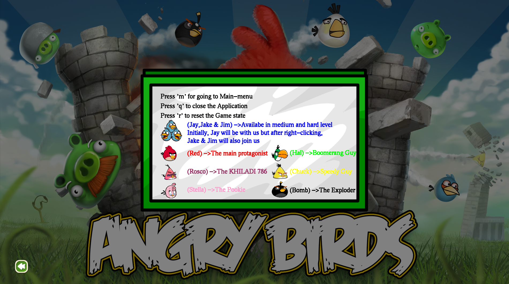

---

## ✍️Name Entering Screen
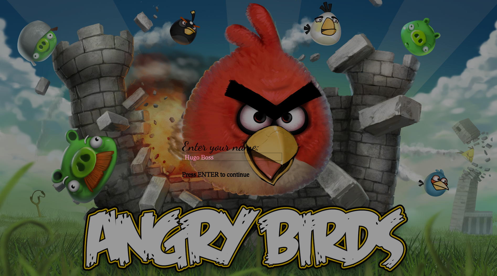

## 🎮 Available Birds
**Jay, Jake & Jim**
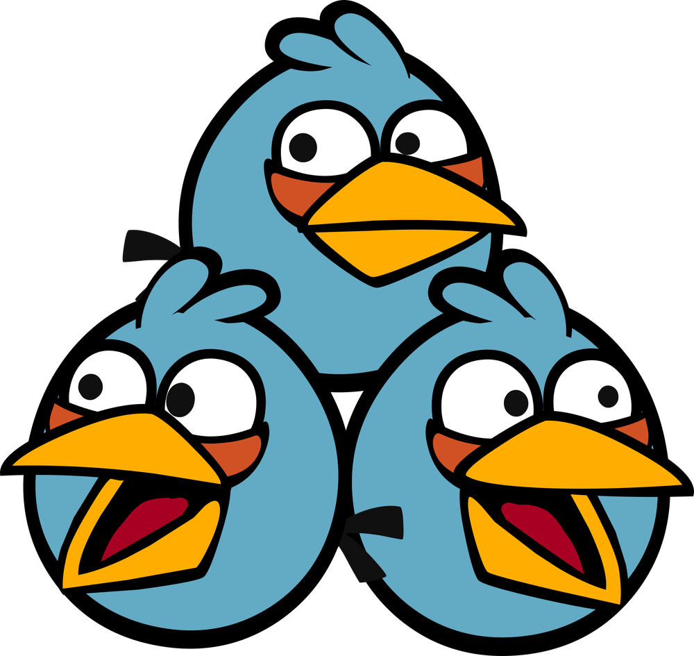

**Rosco**
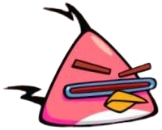

**Chuck**
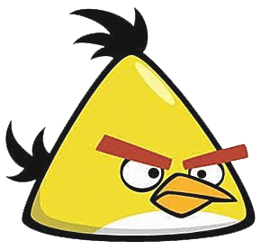

**Red**
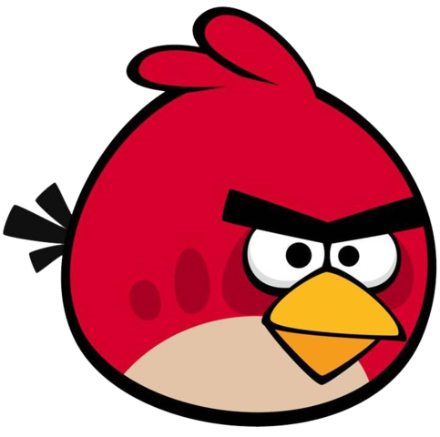

**Hal**
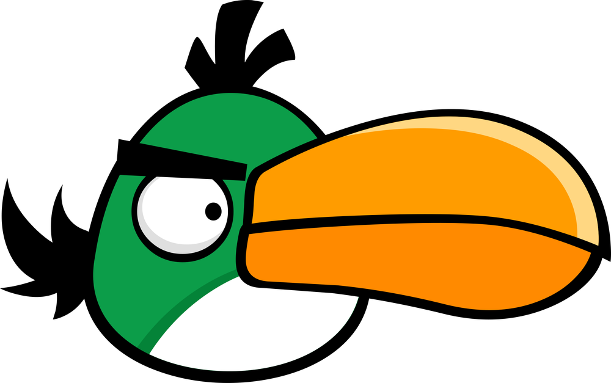

**Bomb**
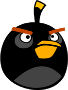

**Stella**
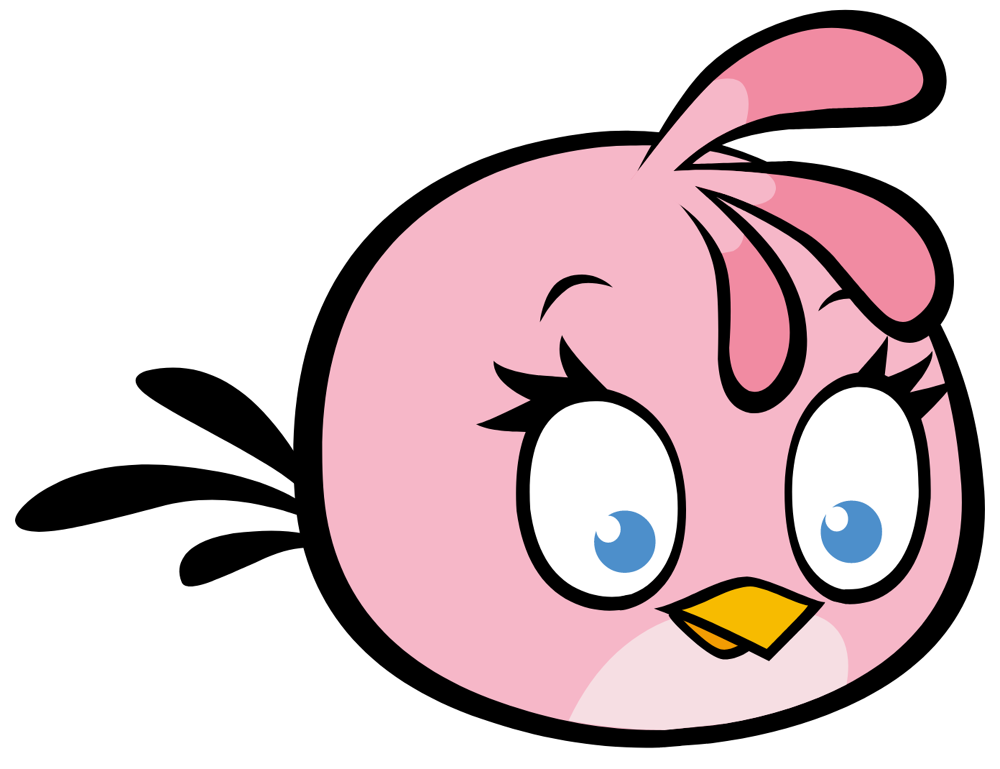

---

## 🎮Gameplay 
**Easy Level**
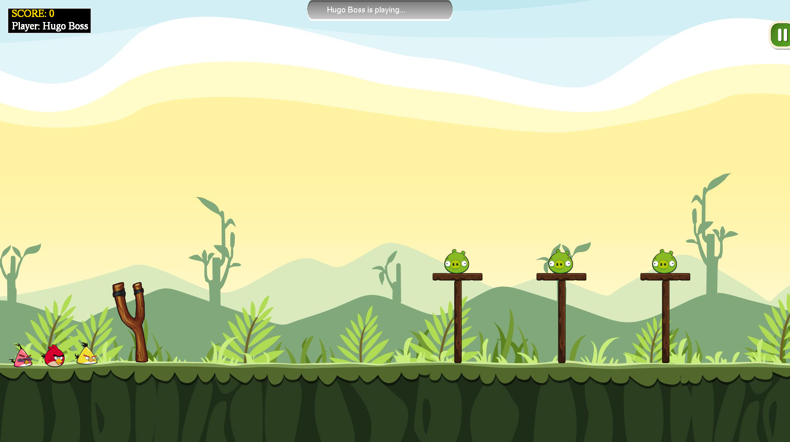

**Medium Level [Bird Splitting]**
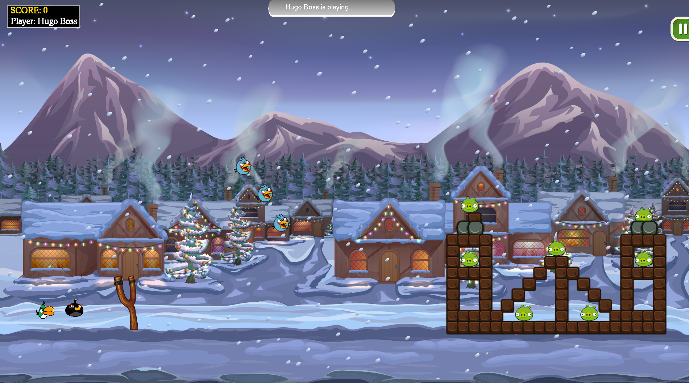

**HardLevel**
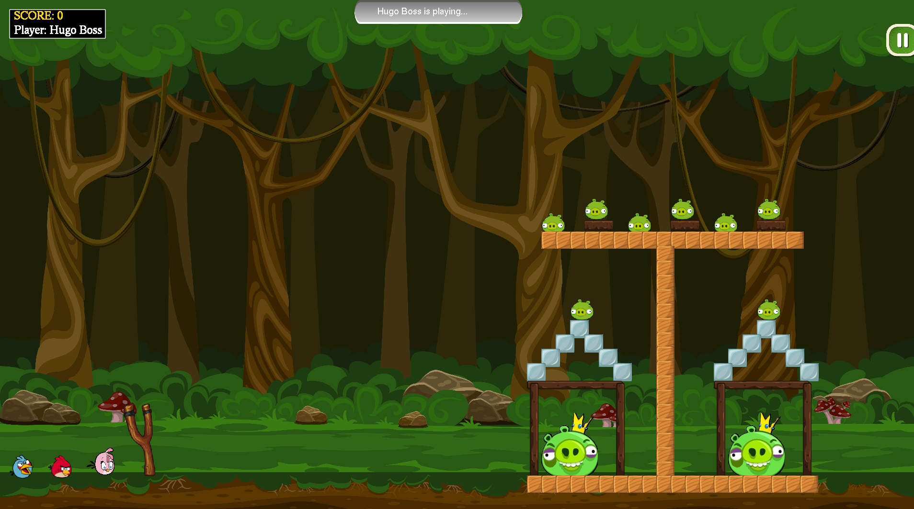

---

## ✅ Level Completed Screen
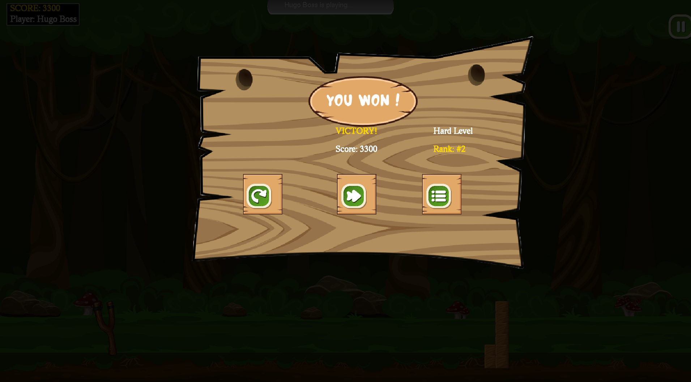

---
## ⏸️ Game Pause Screen
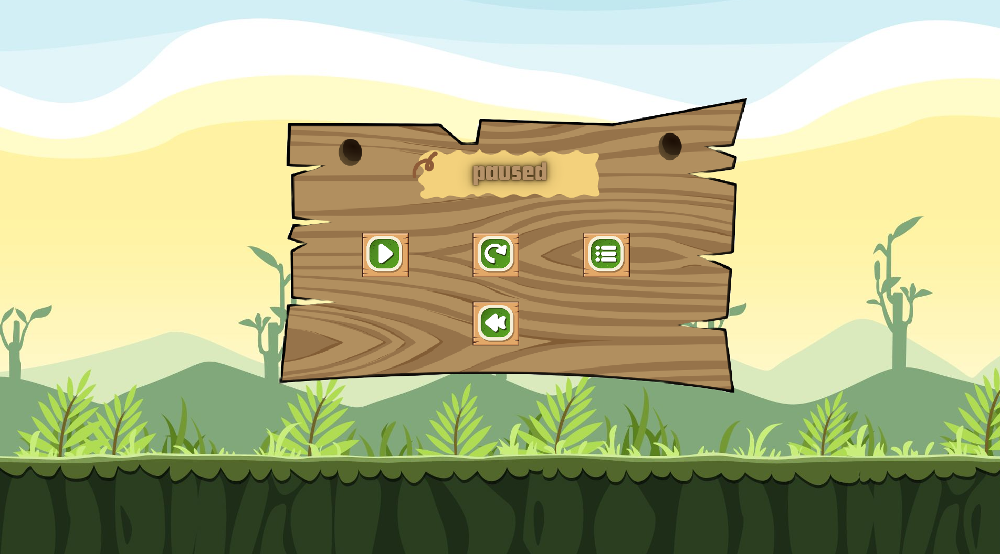

---

## ❌ Level Failed Screen
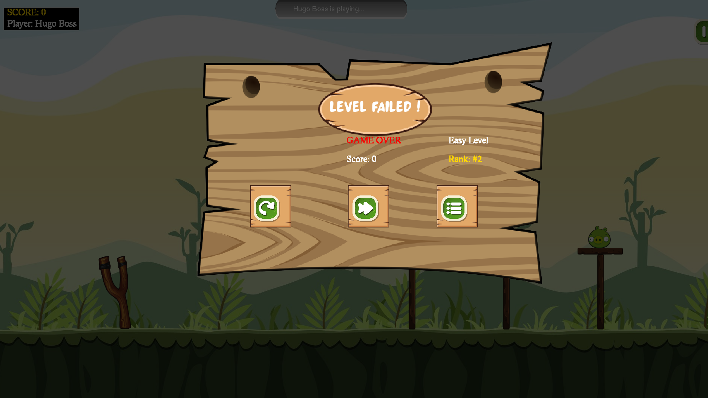

---

## 🏆 Leaderboard
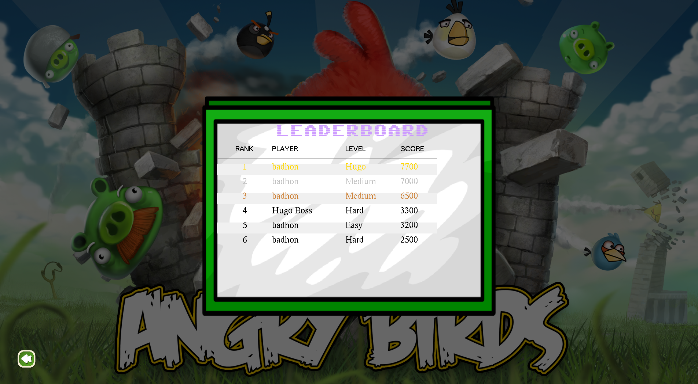

---

